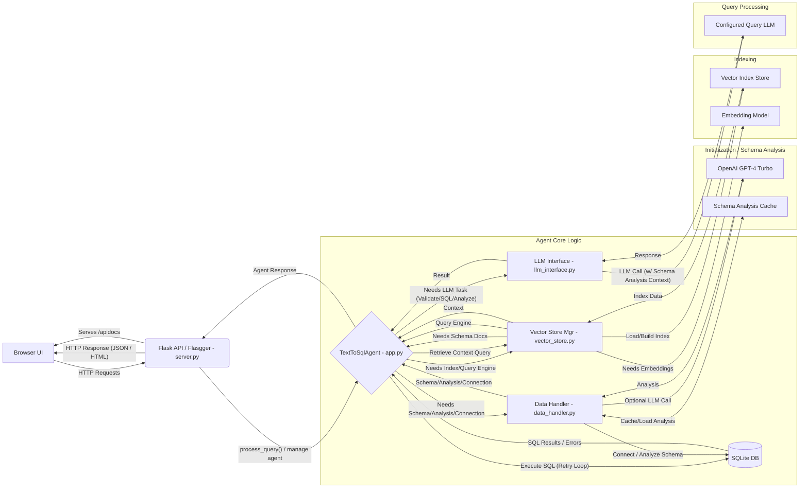

# LumenAI: Conversational Text-to-SQL Agent


This project implements a containerized conversational agent that allows users to query a database (e.g., Adventure Works) using natural language through a web interface.

## Key Features & Enhancements

*   **Web User Interface:** A simple, clean web UI (HTML/CSS/JS) for interacting with the agent, rendering markdown responses (using `marked.js`), and featuring a **scrollable text input area** for longer prompts.
*   **Flask Backend API:** A Flask server provides API endpoints to connect the frontend and the agent logic.
*   **OpenAPI Documentation:** Interactive API documentation available via Swagger UI (`/apidocs`), generated using Flasgger.
*   **Intelligent Query Validation:** The agent first validates user questions using an LLM to determine if SQL generation is needed (`SQL_NEEDED`), if the question can be answered directly (e.g., greetings, schema questions - `DIRECT_ANSWER`), or if clarification is required (`CLARIFICATION_NEEDED`).
*   **Contextual SQL Generation:** Generates SQL queries using schema information, retrieved context from a vector index, conversation history, and **enhanced schema analysis** (see below).
*   **SQL Execution Retry Logic:** If a generated SQL query fails execution, the agent automatically analyzes the error, passes it back to the LLM to generate a corrected query, and retries the execution (up to 5 attempts).
*   **Multi-LLM Strategy:**
    *   Uses `gpt-4-turbo` specifically for the intensive **schema analysis** during initialization or forced refresh (for potentially better accuracy).
    *   Uses a configurable model (defaulting to a Gemini model) for query-time validation, SQL generation, and results analysis.
*   **Vector-based Schema Understanding:** Leverages LlamaIndex embeddings (`text-embedding-3-small` by default) for semantic understanding of the database structure during context retrieval.
*   **Cached Schema Analysis:**
    *   On first load (or refresh) for a database, the agent uses an LLM (`gpt-4-turbo`) to generate detailed descriptions/analysis for each table and column.
    *   This analysis is **cached** to a JSON file (e.g., `schema_analysis_cache/user_data.db.json`) specific to the database being loaded.
    *   On subsequent startups, the agent **loads the analysis from the cache**, significantly speeding up initialization and reducing LLM calls.
    *   The cache file is automatically deleted if the corresponding database is removed via the UI.
*   **Enhanced LLM Context:** The **cached detailed schema analysis** is provided as additional context to the LLM during question validation, SQL generation, and results analysis, improving accuracy and understanding.
*   **Conversation History:** Maintains chat context across turns for improved follow-up queries and comparative analysis.
*   **Forced Index & Analysis Refresh:** Provides an API endpoint (`/refresh-index`) and UI button to forcefully delete caches (vector store and schema analysis) and rebuild the index and analysis using the existing database file.
*   **Containerized Deployment:** Fully containerized using Docker for easy setup and execution.
*   **Simplified Execution:** Includes a `dockershell.sh` script to build the Docker image and run the container with necessary volume mounts (including persistence for the schema analysis cache), environment variables (API keys), and port mappings.

## Architecture Overview

The application follows a three-tier architecture:

1.  **Frontend (Web UI):**
    *   Built with HTML, CSS, and vanilla JavaScript (`static/`, `templates/`).
    *   Includes `marked.js` to render markdown responses.
    *   Provides the chat interface for the user.
    *   Sends user questions to the backend API (`/query`).
    *   Displays responses and generated SQL from the backend.

2.  **Backend (Flask API):**
    *   Implemented in `server.py` using Flask and Flasgger.
    *   Exposes API endpoints (documented via `/apidocs`).
    *   Serves the static UI files (`GET /`).
    *   Manages the lifecycle of the `TextToSqlAgent`.
    *   Handles data upload, deletion, and cache refresh requests.
    *   Returns JSON responses to the frontend.

3.  **Agent Logic (`TextToSqlAgent` & Modules):**
    *   **`app.py` (`TextToSqlAgent`):** Orchestrates the query process (including the SQL retry loop), manages conversation history, handles LLM instance caching (`_get_llm`), stores the loaded schema analysis, and coordinates interactions between other modules.
    *   **`data_handler.py`:** Responsible for connecting to the database, generating/caching/loading the detailed **LLM schema analysis**, providing the raw schema string, and establishing persistent DB connections.
    *   **`llm_interface.py`:** Contains the specific prompt templates and functions for interacting with LLMs (using raw schema and detailed analysis context) for core tasks: question validation, SQL generation, and results analysis.
    *   **`vector_store.py` (`VectorStoreManager`):** Manages the lifecycle of the LlamaIndex `VectorStoreIndex` - checking cache validity, loading from cache, building a new index, persisting, and providing the query engine.
    *   The agent uses LlamaIndex (`VectorStoreIndex`, `OpenAIEmbedding`) for semantic context retrieval (via the `VectorStoreManager`).
    *   Interacts with LLMs (OpenAI `gpt-4-turbo` for schema analysis via `data_handler`, configured model like Gemini for query tasks via `llm_interface`).



### Architecture Diagram Images


## Project Structure

```
.
├── README.md
├── LICENSE
├── .gitignore
└── src/
    └── app/                      # Main Application
        ├── Dockerfile
        ├── Pipfile
        ├── Pipfile.lock
        ├── .dockerignore
        ├── dockershell.sh        # Build & Run script
        ├── app.py                # Core TextToSqlAgent logic (Orchestration)
        ├── server.py             # Flask server & API endpoints
        ├── data_handler.py       # Database schema loading and analysis logic + Caching
        ├── llm_interface.py      # LLM prompt templates and task execution functions
        ├── vector_store.py       # Vector store index management logic
        ├── secrets/
        │   ├── openai_api_key.txt # (User must create)
        │   └── google_api_key.json # (Optional, for Gemini ADC)
        ├── uploads/              # (Generated) Database file(s) live here
        │   └── user_data.db      # Example DB name
        ├── output/               # (Generated) General output directory
        ├── static/
        │   ├── script.js         # Frontend JavaScript
        │   └── style.css         # Frontend CSS
        ├── templates/
        │   └── index.html        # Frontend HTML
        ├── vector_store_cache/   # (Generated) Vector index cache
            └── ...
        └── schema_analysis_cache/ # (Generated) LLM Schema analysis cache
            └── user_data.db.json # Example cache file name
        # reports/ might exist containing project documentation
```

## API

The backend exposes API endpoints documented via Swagger UI.

*   **`GET /apidocs/`**:
    *   **Purpose:** Serves the interactive Swagger UI documentation.
*   **`GET /`**:
    *   **Purpose:** Serves the main HTML page (`index.html`) for the user interface.
*   **`GET /status`**:
    *   **Purpose:** Checks if the agent is initialized and ready (based on DB presence and successful initialization).
*   **`POST /query`**:
    *   **Purpose:** Receives a user question and returns the agent's response. Handles SQL generation/execution with retries.
    *   **Request Body (JSON):** `{ "question": "<user_question>", "model": "<optional_llm_name>" }`
    *   **Response Body (JSON):** `{ "response_type": "<type>", "message": "<agent_response>", "sql_query": "<sql_or_null>" }`
        *   `response_type` can be `sql_analysis`, `direct_answer`, `clarification_needed`, `error`.
*   **`POST /upload-data`**:
    *   **Purpose:** Uploads one or more CSV files. Deletes existing data/caches, creates a new SQLite DB, and initializes the agent (including schema analysis and indexing).
    *   **Request Body (multipart/form-data):** `files` field containing CSV file(s).
*   **`POST /remove-data`**:
    *   **Purpose:** Shuts down the agent, deletes the database file (`uploads/user_data.db`), its corresponding schema analysis cache file (e.g., `schema_analysis_cache/user_data.db.json`), and the vector store cache directory (`vector_store_cache/`).
*   **`POST /refresh-index`**:
    *   **Purpose:** **Forces** a rebuild. Shuts down agent, deletes the schema analysis cache file and the vector store cache directory, then re-initializes the agent (re-analyzing schema with GPT-4 Turbo, rebuilding vector index) using the existing database file.

## Running Instructions

**Prerequisites:**

*   Docker installed and running.
*   Git (to clone the repository).
*   An OpenAI API key (with access to `gpt-4-turbo` for schema analysis).
*   Google Cloud credentials correctly configured for Application Default Credentials (ADC) for the default query model (Gemini). (e.g., via `gcloud auth application-default login` or a service account key file pointed to by `GOOGLE_APPLICATION_CREDENTIALS`).

**Steps:**

1.  **Clone the repository** (if you haven't already).
2.  **Navigate to the application directory:**
    ```bash
    cd path/to/repository/src/app
    ```
3.  **Create Secrets File(s):**
    *   Create the directory `secrets` if it doesn't exist: `mkdir -p secrets`
    *   **OpenAI:** Create `secrets/openai_api_key.txt`. Paste *only* your OpenAI API key into this file and save it.
    *   **Google:** Ensure Application Default Credentials (ADC) are configured OR place your service account `google_api_key.json` file in the `secrets` directory.
4.  **Run the Application:**
    *   Make the script executable (if necessary): `chmod +x dockershell.sh`
    *   Execute the script:
        ```bash
        bash dockershell.sh
        ```
        This script will:
        *   Build the Docker image (`text-to-sql-app`), installing dependencies including `flasgger`.
        *   Stop and remove any previously running container named `lumenai`.
        *   Run a new container named `lumenai`, mapping host port 5001 to container port 5000 (`-p 5001:5000`), passing the OpenAI API key environment variable, setting `GOOGLE_APPLICATION_CREDENTIALS` (if using a key file), and mounting necessary volumes (`output`, `secrets`, `vector_store_cache`, `schema_analysis_cache`, `uploads`).

5.  **Access the Application:**
    *   Open your web browser and navigate to: `http://localhost:5001`
6.  **(First Run/No Data):** Use the UI to upload CSV files. This will create the `uploads/user_data.db`, analyze the schema (using GPT-4 Turbo), save the analysis cache, build the vector index, and enable the chat interface.
7.  **Access API Docs:** Navigate to `http://localhost:5001/apidocs/`

## Requirements Summary

*   Docker
*   Python 3.9+ (as specified in Dockerfile)
*   OpenAI API Key (`gpt-4-turbo` access required)
*   Google Cloud Credentials for Gemini (required for default query model)
*   Required Python packages (installed via Pipfile within Docker): `Flask`, `flasgger`, `llama-index`, `llama-index-llms-openai`, `llama-index-llms-gemini`, `llama-index-embeddings-openai`, `openai`, `pandas`, etc.
