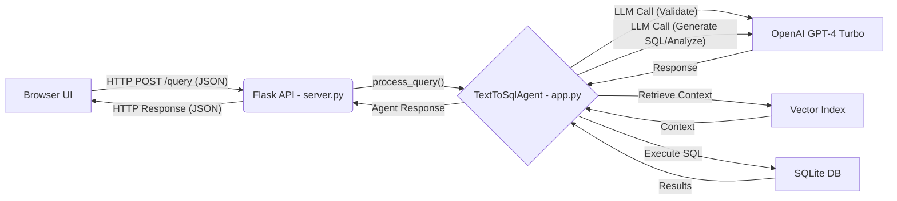

# LumenAI: Conversational Text-to-SQL Agent

This project implements a containerized conversational agent that allows users to query a database (Adventure Works) using natural language through a web interface.

## Key Features & Enhancements

*   **Web User Interface:** A simple, clean web UI (HTML/CSS/JS) for interacting with the agent.
*   **Flask Backend API:** A Flask server provides an API endpoint (`/query`) to connect the frontend and the agent logic.
*   **Intelligent Query Validation:** The agent first validates user questions using an LLM to determine if SQL generation is needed, if the question can be answered directly (e.g., greetings, schema questions), or if clarification is required.
*   **Contextual SQL Generation:** Generates SQL queries using schema information, retrieved context from a vector index, and conversation history.
*   **Upgraded LLM:** Utilizes `gpt-4-turbo` for improved complex query generation and analysis.
*   **Vector-based Schema Understanding:** Leverages LlamaIndex embeddings (`all-MiniLM-L6-v2`) for semantic understanding of the database structure during context retrieval.
*   **Conversation History:** Maintains chat context across turns for improved follow-up queries and comparative analysis.
*   **Performance Optimization:** Implements schema analysis caching (`schema_cache.json`) and parallel processing during initial schema loading for faster startup.
*   **Containerized Deployment:** Fully containerized using Docker for easy setup and execution.
*   **Simplified Execution:** Includes a `dockershell.sh` script to build the Docker image and run the container with necessary volume mounts and port mappings.

## Architecture Overview

The application follows a three-tier architecture:

1.  **Frontend (Web UI):**
    *   Built with HTML, CSS, and vanilla JavaScript (`static/`, `templates/`).
    *   Provides the chat interface for the user.
    *   Sends user questions to the backend API (`/query`).
    *   Displays responses and generated SQL from the backend.

2.  **Backend (Flask API):**
    *   Implemented in `server.py` using Flask.
    *   Exposes a `POST /query` endpoint to receive user questions.
    *   Serves the static UI files (`GET /`).
    *   Instantiates and interacts with the `TextToSqlAgent`.
    *   Returns JSON responses to the frontend.

3.  **Agent Logic (`TextToSqlAgent`):**
    *   Contained within `app.py`.
    *   Manages conversation history.
    *   Performs initial question validation (SQL needed, direct answer, clarification).
    *   Handles schema loading, analysis, and caching.
    *   Uses LlamaIndex (`VectorStoreIndex`, `HuggingFaceEmbedding`) for semantic context retrieval.
    *   Interacts with the OpenAI LLM (`gpt-4-turbo`) via LlamaIndex for validation, SQL generation, and analysis.
    *   Connects to the SQLite database (`output/adventure_works.db`) to execute generated queries.



## Project Structure

```
.
├── README.md
├── LICENSE
├── .gitignore
└── src/
    ├── app/                      # Main Application
    │   ├── Dockerfile
    │   ├── Pipfile
    │   ├── Pipfile.lock
    │   ├── .dockerignore
    │   ├── dockershell.sh        # Build & Run script
    │   ├── app.py                # Core TextToSqlAgent logic
    │   ├── server.py             # Flask server & API endpoint
    │   ├── schema_cache.json     # (Generated on first run)
    │   ├── secrets/
    │   │   └── openai_api_key.txt # (User must create)
    │   ├── output/
    │   │   └── adventure_works.db  # Database file
    │   ├── static/
    │   │   ├── script.js         # Frontend JavaScript
    │   │   └── style.css         # Frontend CSS
    │   └── templates/
    │       └── index.html        # Frontend HTML
    └── data/                     # Original Data files (for reference)
        └── ... (AdventureWorks CSV files)
    # data_loader/ might exist if used previously to create the DB
    # reports/ might exist containing project documentation
```

## API

The backend exposes a simple API for the frontend:

*   **`POST /query`**: 
    *   **Purpose:** Receives a user question and returns the agent's response.
    *   **Request Body (JSON):** `{ "question": "<user_question_string>" }`
    *   **Response Body (JSON):** `{ "response_type": "<type>", "message": "<agent_response_string>", "sql_query": "<generated_sql_or_null>" }` 
        *   `response_type` can be `sql_analysis`, `direct_answer`, `clarification_needed`, or `error`.
*   **`GET /`**: 
    *   **Purpose:** Serves the main HTML page (`index.html`) for the user interface.

*Note:* This application uses Flask and does not automatically generate interactive API documentation like FastAPI's `/docs` page.

## Running Instructions

**Prerequisites:**

*   Docker installed and running.
*   Git (to clone the repository).
*   An OpenAI API key.
*   The `adventure_works.db` SQLite database file.

**Steps:**

1.  **Clone the repository** (if you haven't already).
2.  **Navigate to the application directory:**
    ```bash
    cd path/to/repository/src/app 
    ```
3.  **Create Secrets File:**
    *   Create the directory `secrets` if it doesn't exist: `mkdir -p secrets`
    *   Create a file named `openai_api_key.txt` inside the `secrets` directory.
    *   Paste *only* your OpenAI API key into this file and save it.
4.  **Place Database:**
    *   Ensure your `adventure_works.db` file is located within the `output` directory (`src/app/output/adventure_works.db`).
5.  **Run the Application:**
    *   Make the script executable (if necessary): `chmod +x dockershell.sh`
    *   Execute the script:
        ```bash
        bash dockershell.sh
        ```
        This script will:
        *   Build the Docker image (`text-to-sql-app`).
        *   Stop and remove any previously running container named `lumenai`.
        *   Run a new container named `lumenai`, mapping host port 5001 to the container's port 5000 (`-p 5001:5000`), and mounting the `output` and `secrets` directories.

6.  **Access the Application:**
    *   Open your web browser and navigate to: `http://localhost:5001`

## Requirements Summary

*   Docker
*   Python 3.9 (as specified in Dockerfile)
*   OpenAI API Key (`gpt-4-turbo` access recommended)
*   SQLite database (`adventure_works.db`)
*   Required Python packages (installed via Pipfile within Docker): `Flask`, `llama-index`, `llama-index-llms-openai`, `llama-index-embeddings-huggingface`, `openai`, etc.
