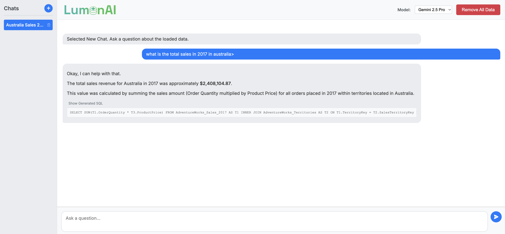
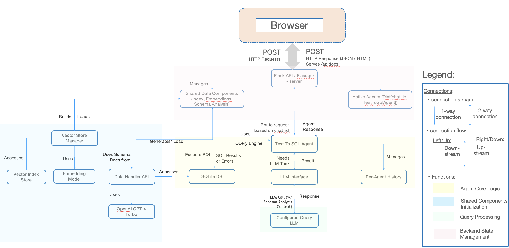

# LumenAI: Conversational Text-to-SQL Agent



This project implements a containerized conversational agent that allows users to query a database (e.g., Adventure Works) using natural language through a web interface.

## Accessing the Live Demo

The application is currently deployed and accessible at:

**[http://35.238.197.154/](http://35.238.197.154/)**

*(Note: This IP address is for the current deployment instance and may change if the application is redeployed.)*

## Key Features & Enhancements

*   **Multi-Chat Web Interface:** A simple, clean web UI (HTML/CSS/JS) featuring a **sidebar for managing multiple independent chat sessions**. Users can create new chats, switch between them, and delete individual chats via an icon in the sidebar.
*   **Per-Chat Conversation History:** Maintains chat context **within each individual chat session** for improved follow-up queries and comparative analysis. User and bot messages are correctly reloaded when switching chats.
*   **Automatic Chat Titles:** New chats are automatically titled based on the content of the first user query, making sessions easier to identify.
*   **Inline SQL Toggle:** Generated SQL queries are displayed within an expandable toggle inside the relevant bot message bubble, rather than a fixed area.
*   **Configurable LLM:** Choose the query LLM (e.g., GPT-4 Turbo, Gemini 2.5 Pro) via a dropdown in the chat header.
*   **Flask Backend API:** A Flask server provides API endpoints to connect the frontend and the agent logic.
*   **OpenAPI Documentation:** Interactive API documentation available via Swagger UI (`/apidocs`), generated using Flasgger.
*   **Intelligent Query Validation:** The agent first validates user questions using an LLM to determine if SQL generation is needed (`SQL_NEEDED`), if the question can be answered directly (e.g., greetings, schema questions - `DIRECT_ANSWER`), or if clarification is required (`CLARIFICATION_NEEDED`), using the conversation history *specific to the current chat*.
*   **Contextual SQL Generation:** Generates SQL queries using schema information, retrieved context from a vector index, **enhanced schema analysis**, and the conversation history *specific to the current chat*.
*   **SQL Execution Retry Logic:** If a generated SQL query fails execution, the agent automatically analyzes the error, passes it back to the LLM to generate a corrected query, and retries the execution (up to 3 attempts).
*   **Multi-LLM Strategy:**
    *   Uses `gpt-4-turbo` specifically for the intensive **schema analysis** during initialization or forced refresh (for potentially better accuracy).
    *   Uses a configurable model (defaulting to a Gemini model) for query-time validation, SQL generation, results analysis, and chat title generation.
*   **Vector-based Schema Understanding:** Leverages LlamaIndex embeddings (`text-embedding-3-small` by default) for semantic understanding of the database structure during context retrieval.
*   **Cached Schema Analysis:**
    *   On first load (or refresh) for a database, the agent uses an LLM (`gpt-4-turbo`) to generate detailed descriptions/analysis for each table and column.
    *   This analysis is **cached** to a JSON file (e.g., `schema_analysis_cache/user_data.db.json`) specific to the database being loaded.
    *   On subsequent startups, the agent **loads the analysis from the cache**, significantly speeding up initialization and reducing LLM calls.
    *   The cache file is automatically deleted if the corresponding database is removed via the UI.
*   **Enhanced LLM Context:** The **cached detailed schema analysis** is provided as additional context to the LLM during question validation, SQL generation, and results analysis, improving accuracy and understanding.
*   **Containerized Deployment:** Fully containerized using Docker for easy setup and execution.
*   **Simplified Execution:** Includes a `dockershell.sh` script to build the Docker image and run the container with necessary volume mounts (including persistence for the schema analysis cache), environment variables (API keys), and port mappings.
*   **Limitation:** The current application runs as a single global instance. It does not yet support concurrent, isolated sessions for multiple independent users.

## Architecture Overview

The application follows a three-tier architecture:

1.  **Frontend (Web UI):**
    *   Built with HTML, CSS, and vanilla JavaScript (`static/`, `templates/`).
    *   Includes `marked.js` to render markdown responses.
    *   Provides the multi-chat interface (sidebar, chat area) for the user.
    *   Sends user questions and chat management requests to the backend API.
    *   Displays responses and inline SQL toggles from the backend.

2.  **Backend (Flask API):**
    *   Implemented in `server.py` using Flask and Flasgger.
    *   Exposes API endpoints (documented via `/apidocs`).
    *   Serves the static UI files (`GET /`).
    *   Manages the overall application state:
        *   Holds **shared, pre-loaded data components** (embedding model, schema analysis, query engine) once data is uploaded (`shared_data_components`).
        *   Manages a dictionary of active `TextToSqlAgent` instances, keyed by `chat_id` (`chat_agents`). Each agent instance uses the shared components but maintains its own conversation history and state.
    *   Routes incoming requests (e.g., `/query`, `/chats/<chat_id>`) to the appropriate agent instance based on the `chat_id`.
    *   Handles data upload, deletion, and initial chat creation.
    *   Returns JSON responses to the frontend.

3.  **Agent Logic (`TextToSqlAgent` & Modules):**
    *   **`app.py` (`TextToSqlAgent`):** Represents a single chat session. Orchestrates the query process (including validation, SQL generation/retry loop, analysis), manages **per-agent conversation history** (`ConversationHistory`), stores the `chat_title`, handles LLM instance caching for the agent (`_get_llm`), and coordinates interactions with other modules using the shared data components.
    *   **`data_handler.py`:** Responsible for connecting to the database, generating/caching/loading the shared detailed **LLM schema analysis**, providing the raw schema string, and establishing DB connections (used per-agent).
    *   **`llm_interface.py`:** Contains the specific prompt templates and functions for interacting with LLMs (using raw schema, detailed analysis context, and per-chat history) for core tasks: question validation, SQL generation, results analysis, and **chat title generation**.
    *   **`vector_store.py` (`VectorStoreManager`):** Manages the lifecycle of the shared LlamaIndex `VectorStoreIndex` - checking cache validity, loading from cache, building a new index, persisting, and providing the shared query engine.
    *   The agent uses LlamaIndex (`VectorStoreIndex`, `OpenAIEmbedding`) for semantic context retrieval (via the shared `VectorStoreManager`).
    *   Interacts with LLMs (OpenAI `gpt-4-turbo` for schema analysis via `data_handler`, configured model like Gemini for query/title tasks via `llm_interface`).


*(Diagram updated to reflect multi-agent architecture)*

### Architecture Diagram Images
*(Note: Linked images below might be outdated compared to the Mermaid diagram above)*




## Project Structure

```
.
├── README.md
├── LICENSE
├── .gitignore
└── src/
    └── app/                      # Main Application
        ├── Dockerfile
        ├── Pipfile
        ├── Pipfile.lock
        ├── .dockerignore
        ├── dockershell.sh        # Build & Run script
        ├── app.py                # Core TextToSqlAgent logic (Orchestration per chat)
        ├── server.py             # Flask server & API endpoints (Multi-agent mgmt)
        ├── data_handler.py       # Database schema loading and analysis logic + Caching
        ├── llm_interface.py      # LLM prompt templates and task execution functions (incl. title)
        ├── vector_store.py       # Vector store index management logic
        ├── secrets/
        │   ├── openai_api_key.txt # (User must create)
        │   └── google_api_key.txt # (User must create, holds Google API Key)
        ├── uploads/              # (Generated) Temp storage for uploaded CSVs
        ├── output/               # (Generated) Database file(s) live here (e.g., user_data.db)
        ├── static/
        │   ├── script.js         # Frontend JavaScript (handles multi-chat UI)
        │   ├── style.css         # Frontend CSS
        │   ├── logo.svg
        │   ├── favicon.svg
        │   └── delete.svg        # Delete icon for chat list
        ├── templates/
        │   └── index.html        # Frontend HTML (with sidebar)
        ├── vector_store_cache/   # (Generated) Vector index cache
            └── ...
        └── schema_analysis_cache/ # (Generated) LLM Schema analysis cache
            └── user_data.db.json # Example cache file name
        # reports/ might exist containing project documentation
```

## API

The backend exposes API endpoints documented via Swagger UI (`/apidocs`).

*   **`GET /apidocs/`**:
    *   **Purpose:** Serves the interactive Swagger UI documentation.
*   **`GET /`**:
    *   **Purpose:** Serves the main HTML page (`index.html`) for the user interface.
*   **`GET /status`**:
    *   **Purpose:** Checks if data is loaded and returns the list of active chats.
    *   **Response Body (JSON):** `{ "is_data_loaded": <boolean>, "active_chats": [ { "chat_id": "<id>", "title": "<title>" }, ... ] }`
*   **`GET /chats`**:
    *   **Purpose:** Gets a list of active chat session IDs (Simple list).
    *   **Response Body (JSON):** `[ "<chat_id_1>", "<chat_id_2>", ... ]`
*   **`POST /chats`**:
    *   **Purpose:** Creates a new chat session instance. Requires data to be loaded first.
    *   **Response Body (JSON):** `{ "chat_id": "<new_chat_id>" }`
*   **`DELETE /chats/<chat_id>`**:
    *   **Purpose:** Deletes a specific chat session instance.
    *   **Response Body (JSON):** `{ "message": "Chat session <chat_id> deleted." }`
*   **`POST /query`**:
    *   **Purpose:** Receives a user question for a specific chat session and returns the agent's response. Handles SQL generation/execution with retries, and potentially generates a chat title on the first query.
    *   **Request Body (JSON):** `{ "question": "<user_question>", "chat_id": "<target_chat_id>", "model": "<optional_llm_name>", "generate_title": <boolean_optional> }`
    *   **Response Body (JSON):** `{ "response_type": "<type>", "message": "<agent_response>", "sql_query": "<sql_or_null>", "chat_title": "<current_chat_title>" }`
        *   `response_type` can be `sql_analysis`, `direct_answer`, `clarification_needed`, `error`.
*   **`POST /upload-data`**:
    *   **Purpose:** Uploads one or more CSV files. Deletes ALL existing data/caches/chats, creates a new SQLite DB (`output/user_data.db`), initializes shared components (schema analysis, indexing), and creates the *first* initial chat session.
    *   **Request Body (multipart/form-data):** `files` field containing CSV file(s).
    *   **Response Body (JSON):** `{ "message": "...", "new_chat_id": "<id_of_first_chat>" }`
*   **`POST /remove-data`**:
    *   **Purpose:** Shuts down all agent instances, deletes the database file (`output/user_data.db`), its corresponding schema analysis cache file (e.g., `schema_analysis_cache/user_data.db.json`), the vector store cache directory (`vector_store_cache/`), clears all chat states, and resets the UI to the data upload state.
    *   **Response Body (JSON):** `{ "message": "...", "warnings": [...] }` or `{ "message": "...", "errors": [...], "warnings": [...] }`

## ML Workflow Overview

The application leverages several machine learning components:

*   **LLMs for Core Tasks:**
    *   A configurable LLM (defaulting to a Gemini model) handles query-time tasks: validating user intent, generating SQL queries, analyzing results, and creating chat titles.
    *   A potentially more powerful LLM (`gpt-4-turbo`) is used for the initial, intensive analysis of the database schema to generate detailed descriptions, which are then cached.
*   **Embeddings for Semantic Understanding:** `text-embedding-3-small` is used by default to create vector representations of the database schema information. This allows the system to retrieve relevant schema parts based on the semantic meaning of the user's question, improving context for SQL generation.
*   **Caching for Efficiency:** Both the detailed schema analysis (generated by the LLM) and the vector index are cached to disk. This significantly speeds up subsequent application starts and reduces the number of required LLM calls and embedding computations.

## Deployment & CI/CD

*   **Containerization:** The application is packaged as a Docker container, encapsulating all dependencies and ensuring consistent execution across environments. The `Dockerfile` and `dockershell.sh` script facilitate building and running the container.
*   **CI/CD Pipeline (GitHub Actions):** This project utilizes a GitHub Actions workflow for continuous integration and continuous deployment. The pipeline is automatically triggered on pushes or merges to the `main` branch.
    *   **Trigger:** On push/merge to the `main` branch.
    *   **Steps:**
        1.  Linting and static analysis.
        2.  Running unit/integration tests (if available).
        3.  Building the Docker image.
        4.  Pushing the Docker image to a container registry (e.g., Google Container Registry - GCR, Docker Hub).
        5.  Triggering deployment to the target environment (e.g., GKE).

## Kubernetes Deployment on GCP (GKE)

The application is deployed to Google Kubernetes Engine (GKE) on Google Cloud Platform (GCP). The deployment process and configuration are as follows:

**Prerequisites for the existing deployment:**
*   A GCP project with billing enabled.
*   `gcloud` CLI installed and configured for interaction with the project.
*   `kubectl` installed for managing Kubernetes resources.
*   An active GKE cluster.
*   The application's Docker image pushed to Google Container Registry (GCR) or Artifact Registry.

**Kubernetes Manifests & Resources:**
The deployment utilizes YAML manifest files for the following Kubernetes resources:
*   **`Deployment`**: Manages the application pods, specifying the Docker image from GCR/Artifact Registry, resource requests/limits, and environment variables (with API keys mounted from Secrets).
*   **`Service`**: An external LoadBalancer service exposes the application, providing an external IP address for web access.
*   **`Secret`**: API keys (OpenAI, Google) are managed securely using Kubernetes Secrets and mounted into the application pods, avoiding hardcoding.
*   **`PersistentVolume` & `PersistentVolumeClaim`**: Persistent storage is provisioned using GCP persistent disks for the `output/`, `vector_store_cache/`, and `schema_analysis_cache/` directories, ensuring data persistence across pod restarts and deployments.

**Deployment Process:**
The Kubernetes manifests are applied to the GKE cluster using `kubectl apply -f <manifest-directory>/`.

**Node Pool Scaling:**
The GKE cluster's node pools have been tested for scaling both up and down to adjust compute resources as needed. Scaling is performed using the `gcloud` command. For example, to resize a node pool:
`gcloud container clusters resize CLUSTER_NAME --node-pool=NODE_POOL_NAME --num-nodes=DESIRED_NODE_COUNT --zone=CLUSTER_ZONE`
*(Replace `CLUSTER_NAME`, `NODE_POOL_NAME`, `DESIRED_NODE_COUNT`, and `CLUSTER_ZONE` with your specific values).*

**Configuration Management:**
While Ansible can be used for provisioning the GKE cluster itself (as detailed in the Ansible deployment section), the application deployment within the cluster is primarily managed via the Kubernetes manifests.

* **Deployment Architecture Diagram:** *


## Running Instructions

This section describes the primary automated deployment method and alternative approaches.

### 1. Automated Deployment (GitHub Actions - Recommended)

This project is configured with a CI/CD pipeline using GitHub Actions, making deployment straightforward.

**Workflow:**

1.  **Develop & Commit:** Make your code changes locally.
    ```bash
    # Example: Add changes and commit
    git add .
    git commit -m "feat: Implement new feature"
    ```
2.  **Push to `main`:** Push your committed changes to the `main` branch of the GitHub repository.
    ```bash
    git push origin main
    ```
3.  **Automated Pipeline Execution:** The push automatically triggers the GitHub Actions workflow defined in `.github/workflows/deploy.yml` (ensure this file exists and is correctly configured). This pipeline executes the following steps:
    *   **Linting/Static Analysis:** Checks code quality (e.g., using `flake8` or `black`).
    *   **(Optional) Testing:** Runs automated tests (e.g., using `pytest`).
    *   **Build Docker Image:** Builds the application's Docker image using the `Dockerfile`.
        ```bash
        # Example command within the pipeline script
        docker build -t $REGISTRY_PATH .
        ```
    *   **Push to Registry:** Pushes the tagged image to Google Container Registry (GCR) or Artifact Registry.
        ```bash
        # Example command within the pipeline script
        docker push $REGISTRY_PATH
        ```
    *   **Deploy to GKE:** Connects to your GKE cluster and applies the Kubernetes manifests from the `k8s/` directory.
        ```bash
        # Example commands within the pipeline script
        gcloud container clusters get-credentials $GKE_CLUSTER --zone $GKE_ZONE --project $GCP_PROJECT_ID
        kubectl apply -f k8s/
        ```

**Accessing the Deployed Application:**

*   Once the pipeline completes successfully, the application should be accessible via the external IP address assigned to the Kubernetes `LoadBalancer` service.
*   Find the IP address using `kubectl` (ensure `kubectl` is configured for your GKE cluster):
    ```bash
    # Get the external IP of the service (replace service-name and namespace if needed)
    kubectl get service lumenai-service --namespace default -o jsonpath='{.status.loadBalancer.ingress[0].ip}'
    ```
    (Replace `lumenai-service` with the actual name defined in your `service.yaml` and `default` with the correct namespace if applicable).
*   Access the application in your browser using the retrieved IP: `http://<EXTERNAL-IP>`. (The LoadBalancer typically maps external port 80 to the container's port 5000).

**Prerequisites for Automated Flow:**

*   **GCP Setup:** A configured GCP project with GKE and Container Registry/Artifact Registry enabled and APIs activated.
*   **GKE Cluster:** An active GKE cluster.
*   **Kubernetes Manifests:** Kubernetes YAML files (`deployment.yaml`, `service.yaml`, `secret.yaml`, `pvc.yaml`, etc.) committed to the repository (e.g., in a `k8s/` directory). The `service.yaml` should typically be of type `LoadBalancer`.
*   **GitHub Actions Secrets:** GCP credentials (e.g., a Service Account Key JSON) configured as an encrypted secret (e.g., `GCP_SA_KEY`) in your GitHub repository settings (`Settings -> Secrets and variables -> Actions`). The workflow file also needs environment variables set (e.g., `GCP_PROJECT_ID`, `GKE_CLUSTER`, `GKE_ZONE`, `REGISTRY_PATH`).

### 2. Alternative Deployment (Ansible)

This project includes Ansible playbooks located in the `ansible/` directory to automate provisioning the GKE cluster and deploying the application.

**Prerequisites:**

*   Ansible installed (`pip install ansible google-auth google-cloud-storage google-cloud-container google-api-python-client requests`).
*   GCP Service Account Key JSON file downloaded for authentication.
*   Required Environment Variables Set:
    *   `GCP_PROJECT_ID`: Your Google Cloud Project ID.
    *   `GCP_ZONE`: The GCP zone for the cluster (e.g., `us-central1-c`).
    *   `GCP_SERVICE_ACCOUNT_FILE`: Absolute path to your downloaded Service Account Key JSON file.
    *   `GOOGLE_API_KEY_SECRET`: Your Google API Key.
    *   `OPENAI_API_KEY_SECRET`: Your OpenAI API Key.
*   Docker image built and pushed to GCR/Artifact Registry (see step in Automated Deployment section or Manual Setup).

**Playbooks:**

1.  **`provision_gke.yml`:**
    *   **Purpose:** Enables required GCP APIs and creates the GKE cluster idempotently.
    *   **Run Command (from the repository root):
        ```bash
        ansible-playbook ansible/provision_gke.yml -i ansible/inventory.yml \
          # Optional: Override default cluster name, zone, machine type, etc.
          # -e "gke_cluster_name=my-custom-name" \
          # -e "gcp_zone=us-east1-b"
        ```

2.  **`deploy_app.yml`:**
    *   **Purpose:** Creates the Kubernetes secret for API keys, applies the Kubernetes manifests (`pvc.yaml`, `deployment.yaml.j2`, `service.yaml`) from the `k8s/` directory, waits for rollout, and displays the external IP.
    *   **Run Command (from the repository root, AFTER provisioning and pushing the Docker image):
        ```bash
        # Ensure kubectl context is set to the new cluster (gcloud get-credentials...)
        ansible-playbook ansible/deploy_app.yml -i ansible/inventory.yml \
          # Optional: Specify a different image tag if not 'latest' or Git SHA
          # -e "image_tag=v1.2.3"
        ```

**Workflow:**

1.  Set the required environment variables.
2.  Run the `provision_gke.yml` playbook.
3.  Build and push your desired Docker image version to the registry.
4.  Ensure your local `kubectl` context points to the newly created GKE cluster (the provision playbook attempts this, or run `gcloud container clusters get-credentials...` manually).
5.  Run the `deploy_app.yml` playbook, optionally passing the specific `image_tag` if needed.

### 3. Manual Setup Overview (GCP/GKE Components)

While the automated flow is recommended, understanding the underlying components is helpful. A manual deployment involves interacting directly with:

*   **GCP Project:** The foundation on Google Cloud. (`gcloud config set project YOUR_PROJECT_ID`)
*   **GKE Cluster:** The Kubernetes environment. (`gcloud container clusters create ...`, `gcloud container clusters get-credentials ...`)
*   **Container Registry (GCR/Artifact Registry):** Stores Docker images. (`gcloud auth configure-docker`, `docker push ...`)
*   **Docker:** Used to build the container image locally. (`docker build -t ... .`)
*   **`kubectl`:** The command-line tool to interact with GKE. (`kubectl apply -f ...`, `kubectl get ...`, `kubectl create secret ...`)
*   **Kubernetes Manifests (`k8s/`):** YAML files defining the desired state (Deployment, Service, Secrets, PVCs).

*(Detailed instructions for manually setting up each GCP/GKE component and deploying using `kubectl` are beyond the scope of this README but involve using the `gcloud` and `kubectl` commands exemplified above extensively.)*

### Local Development & Testing

For local development before pushing:

**Prerequisites:**

*   Docker installed and running.
*   Git.
*   API Keys (OpenAI, Google) placed in `./secrets/openai_api_key.txt` and `./secrets/google_api_key.txt` respectively (within `src/app`).

**Steps:**

1.  Navigate to `src/app`.
2.  Ensure secrets files exist (`mkdir -p secrets`, create the `.txt` files).
3.  Run using the provided script:
    ```bash
    chmod +x dockershell.sh
    bash dockershell.sh
    ```
4.  Access the application at `http://localhost:5001`.

## Requirements Summary (for Local Execution)

*   Docker
*   Python 3.9+ (defined in Dockerfile)
*   OpenAI API Key (`gpt-4-turbo` access recommended)
*   Google API Key (for Gemini model)
*   Required Python packages (installed via Pipfile within Docker): `Flask`, `flasgger`, `google-generativeai`, `llama-index`, etc.
